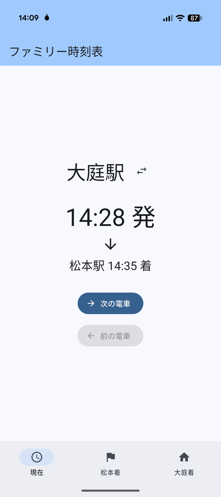
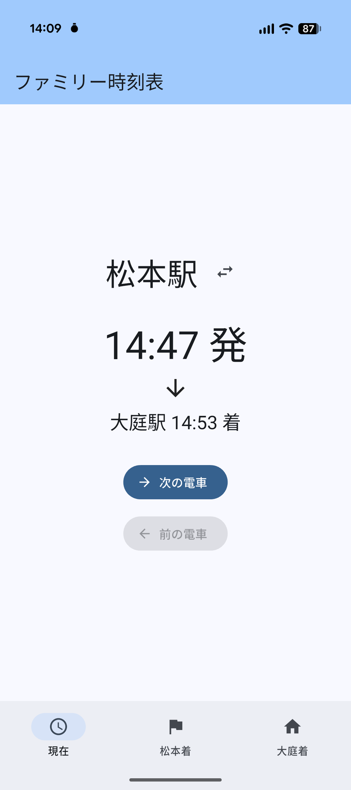
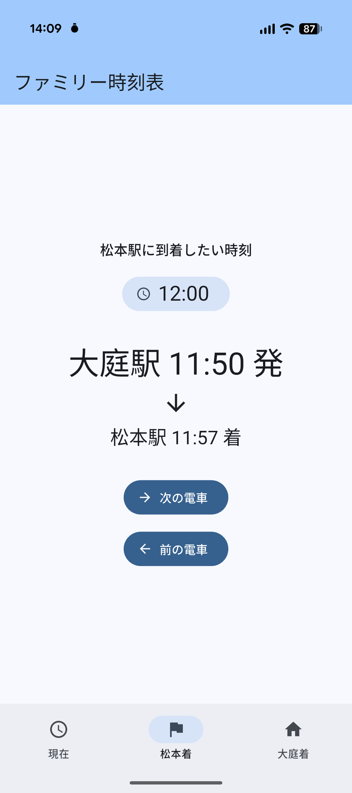
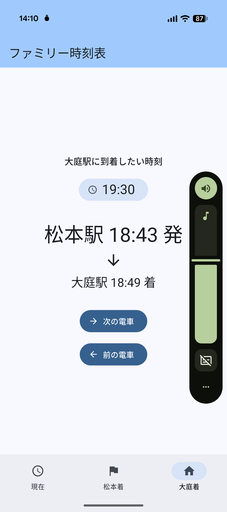

# ファミリー時刻表 (oniwa_station_app)

アルピコ交通上高地線「大庭駅 ⇔ 松本駅」に特化した、自分専用の Android 時刻表アプリ。

## 1. アプリ作成の目的

- いつも使う路線(アルピコ交通上高地線)は **1 時間に 1 本のローカル線**。電車の時刻を確認することが日常茶飯事になる。
- 一方、既存の汎用時刻表アプリは何度もタップしたりネットワーク往復を待たされたりと、目的の電車情報にたどり着くまでが面倒。
- 自分が時刻を知りたいユースケースは限られているので、汎用的な UX はむしろ邪魔。
- それなら **自分だけが使う、自分専用の時刻表アプリ** を作ってしまおうと思い立った(笑)。
- 副次目的として、Flutter で位置情報や現在時刻を扱う実装パターンを習得することも兼ねている。

## 2. 使用技術

- **言語/フレームワーク**: Dart / Flutter (SDK ^3.11.5)
- **UI**: Material 3 (`useMaterial3: true`、シードカラーは Flutter ブルー)
- **位置情報**: [`geolocator`](https://pub.dev/packages/geolocator) ^14.0.2
- **日時処理**: [`intl`](https://pub.dev/packages/intl) ^0.20.2
- **スプラッシュ / アイコン生成**: `flutter_native_splash`, `flutter_launcher_icons`
- **テスト**: `flutter_test` (ドメインロジックは純粋関数化してユニットテスト)
- **対応プラットフォーム**: Android のみ (実機検証: Android 14)
- **時刻表データ**: ネットワーク非依存。`lib/data/train_schedule.dart` に大庭→松本 25 本 / 松本→大庭 25 本をハードコード

### ディレクトリ構成
- `lib/data/` … 駅座標 (`stations.dart`) と時刻表データ (`train_schedule.dart`)
- `lib/domain/` … 純粋関数のドメインロジック (`train_finder.dart`, `target_station_resolver.dart`)
- `lib/service/` … 位置情報サービス (`location_service.dart`)
- `lib/screen/` … 画面ウィジェット (現在 / 松本着 / 大庭着)
- `lib/main.dart` … タブナビゲーション (`IndexedStack` + `NavigationBar`)
- `test/domain/` … ドメインロジックのユニットテスト

## 3. 主な機能と使い方

画面下部のタブで 3 つの機能を切り替える。

### 「現在」タブ — GPS + 現在時刻で次の電車をピンポイント表示
- アプリ起動時 / タブ復帰時 / バックグラウンド復帰時に GPS を取得。
- 大庭駅 500m 圏なら **大庭駅発・松本行き** の次の電車を、松本駅 1km 圏なら **松本駅発・新島々方面** の次の電車を自動表示。GPS 取得不可や圏外時は大庭駅にフォールバック。
- 駅名横の `↔` アイコンで対象駅を手動切り替え可能(GPS の結果と違う駅の電車を一時的に見たい時用)。タブ離脱時に自動判定に戻る。
- 「次の電車」「前の電車」ボタンで前後の便にスライド。現在タブの「前の電車」は乗車可能な便のみ有効。

### 「松本着」タブ — 何時までに松本に着きたいかから逆算
- 時刻ピッカーで希望到着時刻を選ぶと、**その時刻に間に合う最終の大庭発電車** を表示。
- 入力時刻は現在時刻に依存しないので、明日のお出かけプラン確認にも使える。
- 始発でも間に合わない時刻なら「間に合う電車はありません」と表示。
- 「次の電車」「前の電車」で前後便を確認可能。

### 「大庭着」タブ — 何時までに大庭に帰りたいかから逆算
- 同様に希望到着時刻を入力 → **間に合う最終の松本発電車** を表示。

## 4. スクリーンショット

